Have You Ever Wanted To Host Your Express App But You Are A Beginner & Don't
Want To Pay For Cloud? You Are At Right Place Now!!. I Will Give You A Demo On
How To Host Your Express.js Apps For Free On [Deta](https://deta.sh)

**<u>Step 1 : Creating Account On [Deta!.](https://deta.sh)</u>**

Creating A Account On Deta Is As Simple As Writing A Hello World App On Express,
Lol!!. Just Go To [Deta Web](https://web.deta.sh/) & Sign Up There, It Will Look
Like Something Below!!.

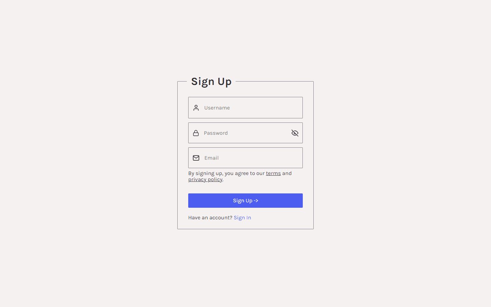

After Signing Up You Will Get A Verification Mail On Your Inbox Just Click The
Link And Verify Your Account

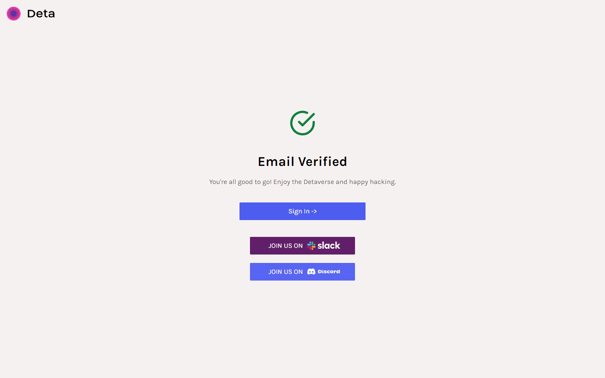

After Verification Click On Sign In And Login To Your Account!!. Yay!, You have
Completed The First Step :)

**<u>Step 2 : Getting Project Id & Key!.</u>**

After Verification & Signing In, Deta Will Automatically Create Your First
Project Called `default` And The Project Key Will Be Shown By Default After
Signing In First Time To Your Account As Like Image Below!!.

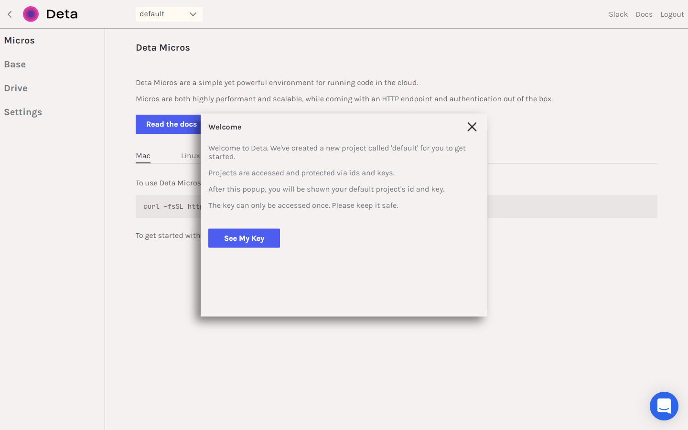

You Will Have To Copy That Project Key And Id And Paste It In Notepad Because It
Will Be Used Further!!.

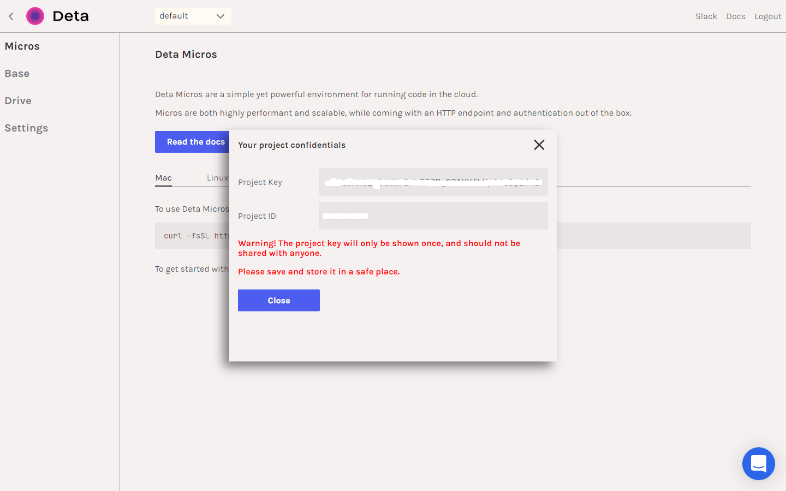

Yay!, You Completed The Second Step Too! Nice :)

**<u>Step 3 : Installing Deta CLI</u>**

Now Install Deta CLI For Your Machine By Pasting Below Code On Your
Shell/Terminal/Powershell!!.

- Mac : `curl -fsSL https://get.deta.dev/cli.sh | sh`
- Linux :- `curl -fsSL https://get.deta.dev/cli.sh | sh`
- Windows :- `iwr https://get.deta.dev/cli.ps1 -useb | iex`

After Installation Just Type `deta login` In Terminal To Login To Your Account
From CLI!

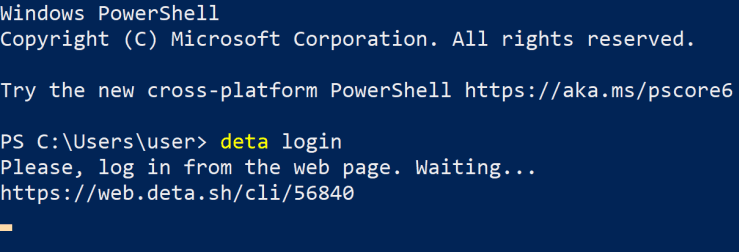

It Will Auto Login To Your Account!.

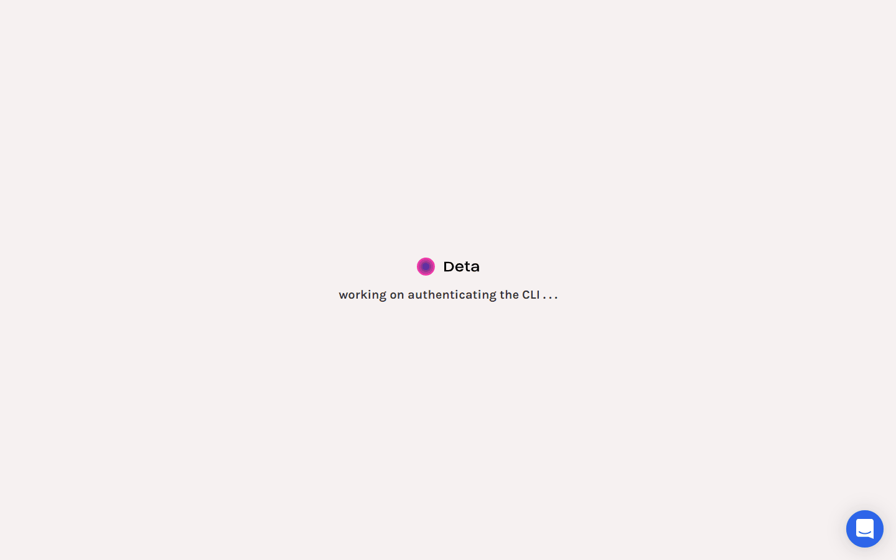

Yay!, You Can Have A Coffee Now Because Third Step Is Completed!.

**<u>Step 4 : Creating Deta Micro & Express App</u>**

Go To Terminal And Type `deta new --node expressapp` To Create A New Micro With
NodeJS Configuration And Name As `expressapp`, Now `cd` To `expressapp` And Open
It In VS Code Or Any Code Editor!.

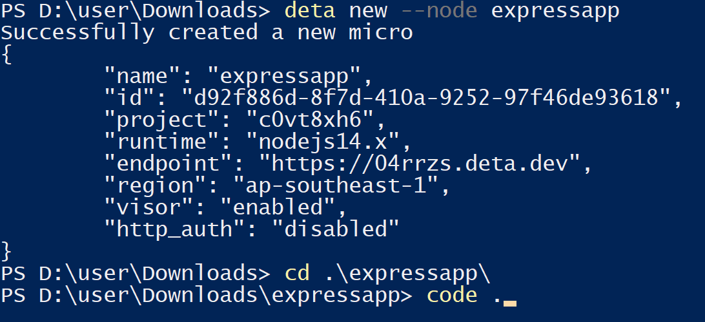

It Will Already Contain A Express App In `index.js`. Just Edit It A Little Bit,
I Have Attached My Code Below!, Also Deta Does Not Listen On Ports, Just Write
`module.exports = app` Instead Of `app.listen(port)`

```js
// Dependencies
const express = require("express");
const app = express();

app.get("/", (req, res) => res.send({ message: "Hello World" }));

// Export app
module.exports = app;
```

Also You Can Add Your Whole Code In `index.js` And Just Install Dependencies You
Have Used In Your App, Here I Have Only Used `express`, So I Will Type
`npm i express` In Terminal!.

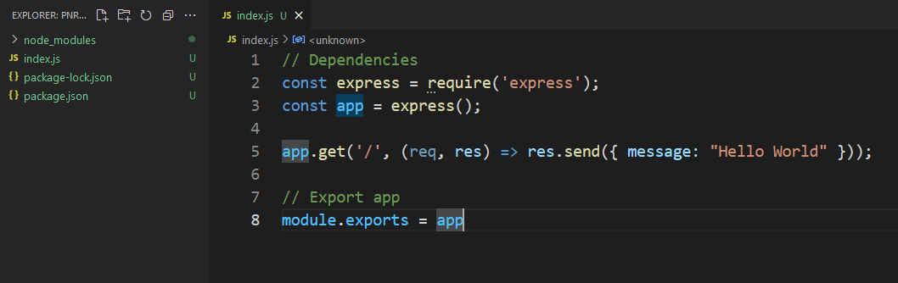

Now Go To Terminal And Type `deta deploy` To Deploy Your App

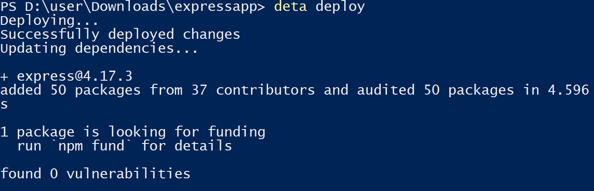

After Deploying Go To [Deta Web](https://web.deta.sh/) And Under Micros Section
You Will Get Your App, Just Click That And Go To The URL It Shows For Your
Deployed App!.

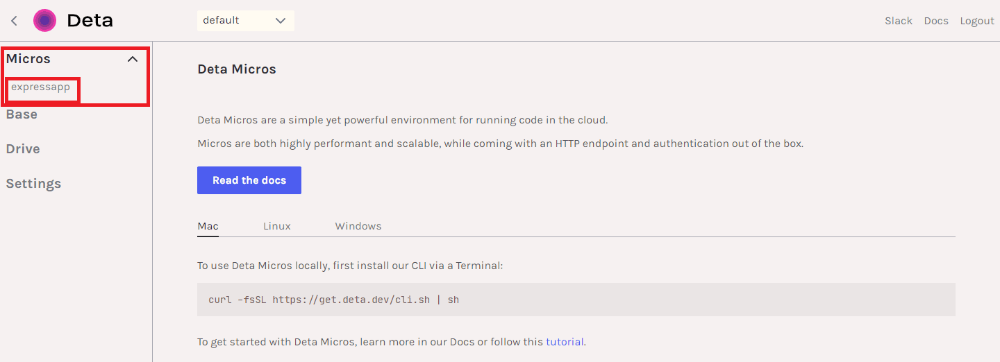

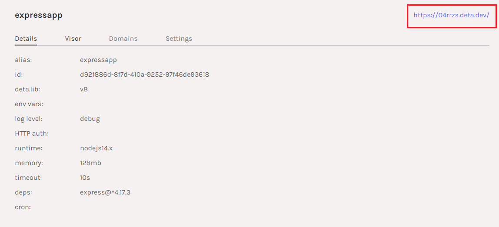

You Can Visit The URL and See Our Express App Is Live Now!!

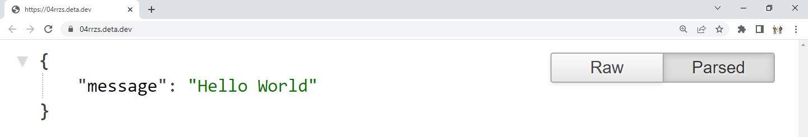

You Can Also Change Domain Name In Domains Section, But You Have To Explore It
Yourself!
